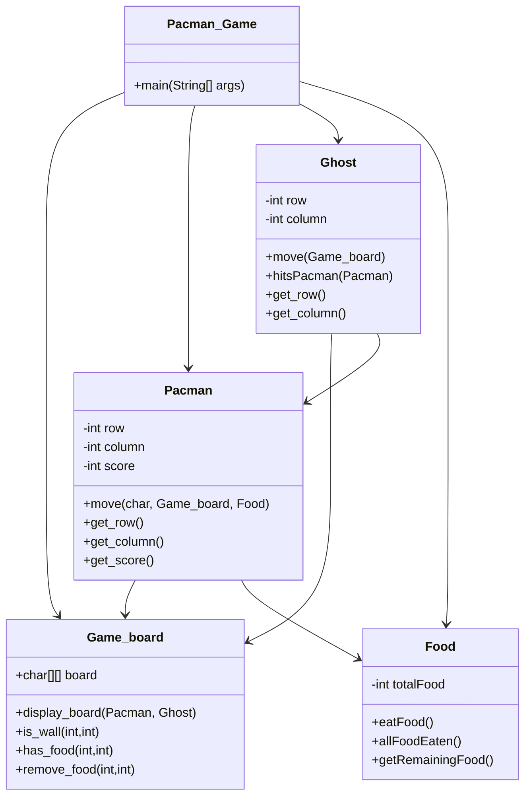

## Pacman Game – Object Oriented Programming (OOP)

## Project Description

This project is a console-based **Pacman Game** developed using **Object-Oriented Programming (OOP)** concepts. The game is built using multiple interacting classes including `Pacman_Game`, `Game_board`, `Pacman`, `Ghost`, and `Food`.
The player controls Pacman using keyboard inputs (W/A/S/D) to collect food while avoiding the ghost. The game ends when all food is eaten (Win) or when the ghost catches Pacman (Game Over).

---

## Features

* OOP based design
* Multiple interacting classes
* Player movement controls
* Random ghost movement
* Score tracking system
* Food collection system
* Win/Lose conditions
* Console based board rendering

---

## Game Controls

| Key | Action     |
| --- | ---------- |
| W   | Move Up    |
| S   | Move Down  |
| A   | Move Left  |
| D   | Move Right |

---

##  Classes Used

### 1. Pacman_Game

* Main class
* Contains game loop
* Handles user input
* Controls game flow

### 2. Pacman

* Stores player position
* Handles movement
* Updates score
* Eats food

### 3. Game_board

* Stores 2D game board
* Displays board
* Detects walls
* Detects food

### 4. Ghost

* Random movement
* Collision detection
* Enemy behavior

### 5. Food

* Counts total food
* Tracks remaining food
* Win condition

---

## UML Class Diagram



---

## Game Logic Flow

1. Game starts
2. Board displayed
3. Player enters move
4. Pacman moves
5. Food eaten → Score increases
6. Check win condition
7. Ghost moves randomly
8. Check collision
9. Repeat until win or lose

---

## OOP Concepts Used

### Encapsulation

* Private variables in each class
* Access using getters

### Abstraction

* Each class handles its own logic

### Object Interaction

* Pacman interacts with Food and Board
* Ghost interacts with Pacman

### Modularity

* Separate classes for each component

---

## Win Condition

Player wins when all food is eaten.

## Lose Condition

Player loses when ghost catches Pacman.

---

## Future Improvements

* Multiple ghosts
* GUI version
* Levels system
* Power pellets
* Smart ghost AI
* Timer system
* High score system

---

## Author

* OOP Lab Project – Pacman Game
* Name: Hafeeza Abdur Rehman
* Registration Number: 2025-CYS-66
* Language: Java

---

```

4. Use W A S D to play

---
